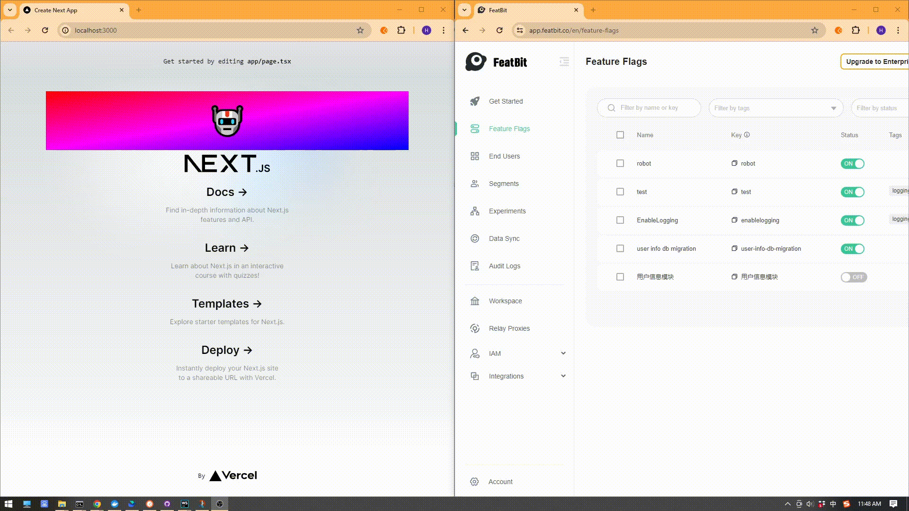

# FeatBit React client SDK example with Next.js

This project is an example of how to use the [featbit-react-client-sdk](https://github.com/featbit/featbit-react-client-sdk) with Next.Js.
It is built based on the project bootstrapped with [`create-next-app`](https://github.com/vercel/next.js/tree/canary/packages/create-next-app).

This example used `withFfcProvider` function to initialize the SDK.

# Rune the example

First, run the development server:

```bash
npm install
npm run dev
```

Open [http://localhost:3000](http://localhost:3000) with your browser to see the result.



# Explications

- fbConfig.ts: contains the configuration of the SDK
- FeatBitProvider.tsx: create a wrapper component to provide the context to descendant components, it is used in the `layout.tsx` file
- test-component.tsx: a client component that consumes the fbClient and flags